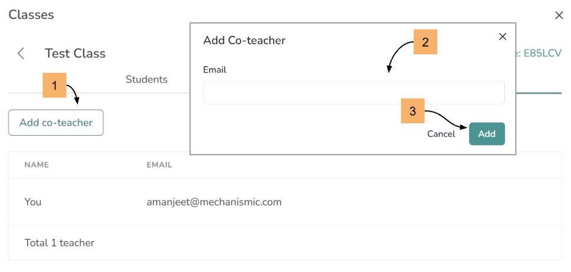

# Sign up (Teachers)

Go to [https://motiongen.io](https://motiongen.io).

## Sign In

If you have an account, then use your username and password to sign in.

## Sign Up

If you have never used MotionGen before, then sign up. You will need to provide an email address, which you have to confirm from your inbox. Thereafter, sign in.

## Create Your Class (Optional)

If your students do not have access to email, then you can create a class for them and share the class code and their usernames. Once you have logged in, you can create a class for your students who will be automatically assigned unique usernames. Your class will also get a unique code. Next, you will have to share usernames and class code with your students so that they can sign in.

  

 

  

## Adding a Co-teacher (Optional)

Once you have created your class, you can also add Co-teachers to your class. However, they have to first create an individual account on MotionGen before you can add them as Co-teachers.

  

### Adding a Co-teacher who already has an individual account on MotionGen

You only have to provide the same email address with which the co-teacher has registered. If the teacher is registered, the system will automatically populate their name and if not, it will display a message "User Not Found".
